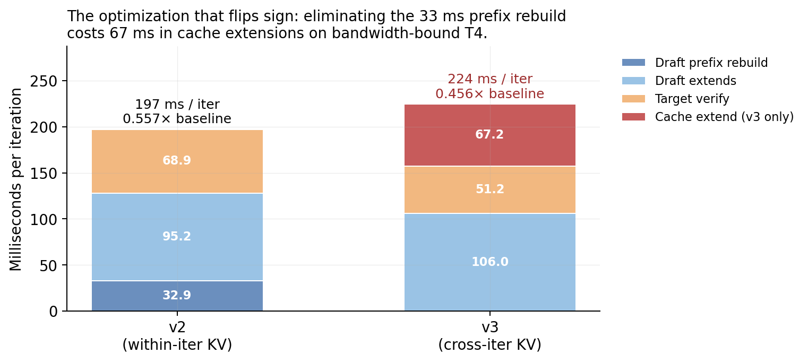
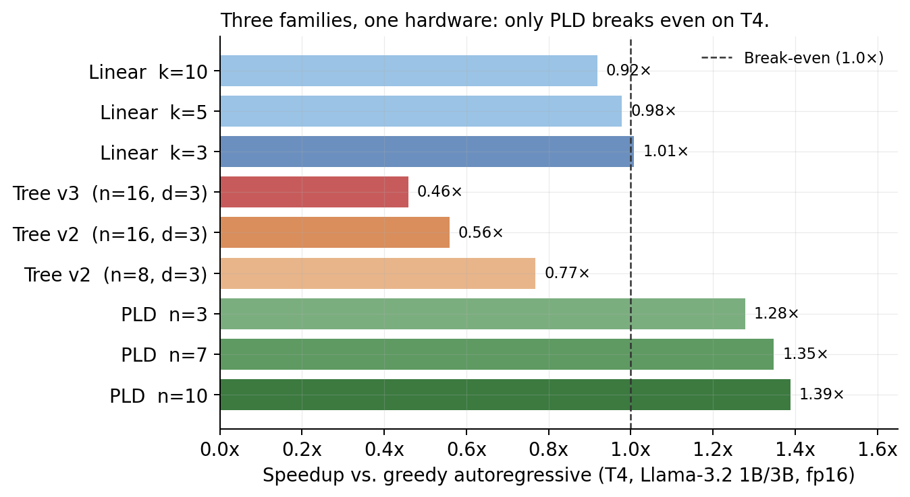
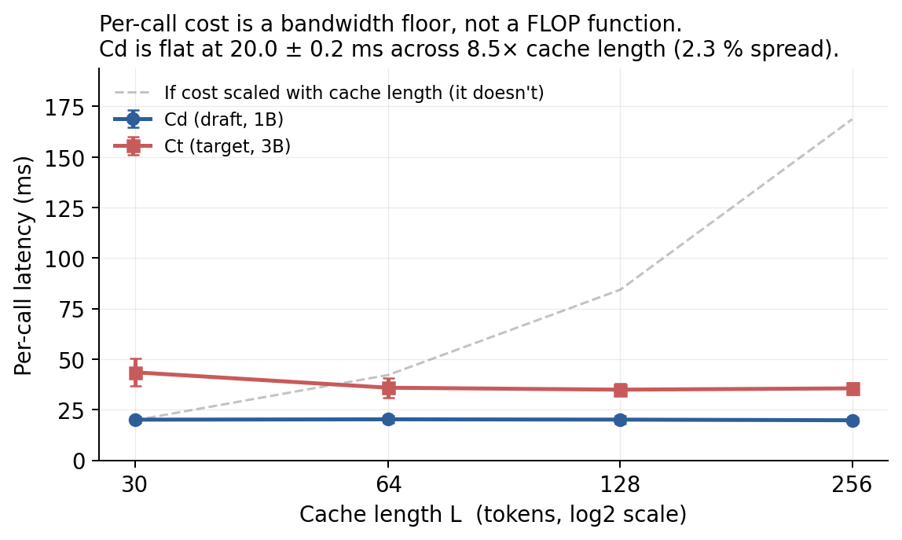

# Speculative Decoding on Bandwidth-Bound Hardware

**Sequoia predicts 1.68×. I measured 0.56×. A four-term decomposition reconciles the 3× gap to within 1.1% — and reveals a standard optimization that *flips sign* on T4.**

A controlled three-family comparison of speculative decoding (linear draft-verify, tree-structured Sequoia, retrieval-based PLD) on a T4 GPU. I port Sequoia's hardware-aware DP optimizer to T4, predict the DP-optimal tree, measure the gap, and decompose it into four independently-measurable hidden assumptions — three in Sequoia's published cost model plus a fourth revealed by attempting the natural cross-iteration KV-persistence optimization, which produces a *measured slowdown* (0.56× → 0.46×) because each cache-extension forward still pays a 20 ms weight-loading floor.



> Duke CS 590 (ML Systems), Spring 2026. Full technical report: [`report/CS590_Project_Final_Report.pdf`](./report/CS590_Project_Final_Report.pdf). Author: Zanwen (Ryan) Fu · zanwen.fu@duke.edu

---

## TL;DR

1. **Cost ratio `c = Cd/Ct = 0.596`** — nearly double the parameter ratio of 0.333 — because per-call cost on T4 is dominated by a ~20 ms weight-loading floor from HBM, not by FLOPs.
2. **Sequoia's tree optimizer overpredicts speedup 3×** on T4. Feeding measured per-iteration components back into Sequoia's equation reconciles to **1.1% of the benchmark** — the algorithm is sound; three specific assumptions in the cost model break.
3. **A standard optimization flips sign.** Cross-iteration KV persistence (v3) is a clear win on A100 and a measurable *slowdown* on T4 because each cache-extension forward still pays the bandwidth floor. The fourth hidden assumption, and the paper's sharpest finding.
4. **PLD is the only family that wins on T4** (1.28–1.39×) because `Cr ≈ 0` via CPU n-gram matching is the only structural bypass of the bandwidth floor.

---

## Verify the claims without a GPU (< 5 seconds)

Every numerical claim in this README is backed by a saved measurement artifact under [`src/results/`](./src/results/). The CLIs below replay the paper's analysis against those artifacts — no GPU, no model download, no licence friction.

```bash
git clone https://github.com/zanwenfu/speculative-decoding-t4
cd speculative-decoding-t4
pip install -r requirements.txt          # matplotlib + pytest; no torch

python -m src.bench.probe_percall         # Cd flat at 20 ms across 8.5× cache range
python -m src.bench.bench_linear --from-results --k 3 5 7 10    # Table 1
python -m src.bench.bench_tree --tree-config 16x3 --version v2 --show-dp   # §9
python -m src.bench.bench_tree --tree-config 16x3 --version v3   # the sign-flip
python -m src.bench.advise --hw T4 --draft 1B --target 3B        # deployable advisor
python -m pytest tests/ -q                # 13 tests pin the headline numbers
```

Sample output — the advisor implementing the paper's practitioner rule:

```
$ python -m src.bench.advise --hw T4 --draft 1B --target 3B
Hardware:          T4 (300 GB/s, Tf=13.0 ms)
Model pair:        1B -> 3B
Predicted c:       0.596
Break-even alpha:  0.697  (for k=3)
Recommendation:    pld
Reason:            c=0.60 (bandwidth-bound regime); tree methods won't break even.
```

### Reproduce on a T4 (Google Colab)

The full CUDA collection path is in [`src/notebooks/`](./src/notebooks/); the CLIs above load the resulting JSON. A single T4 (16 GB HBM, ~300 GB/s) in Colab reproduces the paper end-to-end — select a T4 runtime, `pip install -r requirements-cuda.txt`, set a HuggingFace token, and run the notebooks in order. Expected wall-clock: ~90 minutes.

---

## Headline results



| Family | Configuration | Speedup | Verdict |
|---|---|---:|---|
| **Linear SD** | k=3 | **1.01×** | Marginal; α=0.732 just clears threshold 0.697 |
| Linear SD | k=5 | 0.98× | Crosses into slowdown |
| Linear SD | k=10 | 0.92× | 8% slowdown |
| **Tree SD (v2, within-iter KV)** | n=16, d=3 *(Sequoia DP-optimal)* | 0.56× | Predicted 1.68× |
| Tree SD (v2) | n=8, d=3 | 0.77× | Predicted 1.31× |
| **Tree SD (v3, cross-iter KV)** | n=16, d=3 | **0.46×** | Standard optimization *worsens* v2 |
| **Prompt Lookup Decoding** | n=3 | 1.28× | Only family with consistent speedup |
| Prompt Lookup Decoding | n=7 | 1.35× | — |
| **Prompt Lookup Decoding** | n=10 | **1.39×** | Best result; zero GPU draft cost |

### Sequoia gap decomposition (DP-optimal n=16, d=3)

| Component | Sequoia formula | Measured | Error |
|---|---:|---:|---:|
| Accepted tokens per iter (G) | 4.94 | 2.95 | −40% |
| Verify cost (ms) | 43.3 | 68.9 | +59% |
| Draft cost (ms) | 67.3 | 128.1 | +90% |
| Iter total (ms) | 110.6 | 197.0 | +78% |
| **End-to-end speedup** | **1.68×** | **0.56×** | **−67%** |
| *Calibrated formula (measured terms)* | *0.563×* | *0.557×* | *1.1%* |

Plugging measured per-iteration components back into Sequoia's equation reconciles to within Python-orchestration noise. The gap is not implementation defect or measurement noise — it decomposes cleanly into three structured assumption failures, plus a fourth.

---

## The four hidden assumptions

### 1. Cost scales with FLOPs → Cost scales with bandwidth

Parameter ratio = 0.333; measured `c = 22.42/37.63 = 0.596`. A 1B-fp16 forward pays a ~20 ms weight-loading floor regardless of input length or FLOPs: `2 GB / 300 GB/s ≈ 6.7 ms` for weight streaming, plus ~13 ms fixed per-call overhead (kernel launch, layernorm, RoPE, residuals). Cost ratio `c` must be grounded in wall-clock measurement, not parameter counts.

### 2. Tree verification is ~free → Tree verification is bandwidth-amortized, not compute-amortized

Sequoia assumes `t(n=16) = 1.15 × Ct`: 15% overhead to verify 16 tree nodes versus one token. Measured: `1.83 × Ct`. On A100 compute parallelism makes batched tree-verify nearly free. On T4 memory bandwidth is the bottleneck, so processing more tokens provides minimal amortization. The error is consistent across tree sizes (+59% at n=16, +63% at n=8), confirming a general scaling failure of the `t(n)` approximation.

### 3. Sequential draft calls cost `d × c × Ct` → Each call hits the bandwidth floor

Sequoia predicts 67.3 ms for three sequential draft calls at `c × Ct` each. Measured: 128.1 ms — a full prefix rebuild (32.9 ms) plus four single-token extends (4 × 23.8 ms). The per-call probe shows every extend pays the same ~20 ms floor regardless of how few tokens it adds.

### 4. The bandwidth-floor inversion *(main result)*

> **Result (Bandwidth-Floor Inversion).** On bandwidth-bound hardware, cross-iteration KV persistence — a standard optimization that unambiguously wins on A100 — **strictly worsens** tree speculative decoding, because each cache-extension forward still pays the per-call bandwidth floor. The optimization's sign depends on whether bandwidth or compute is the binding constraint.

The natural fix for assumption 3 is to persist both draft and target KV caches across iterations (v3), eliminating the per-iteration prefix rebuild. On A100 this is unambiguously a win — extending a cache by ~3 tokens requires negligible compute. I implemented it faithfully and benchmarked:

| Component | v2 (within-iter) | v3 (cross-iter) | Δ |
|---|---:|---:|---:|
| Draft prefix rebuild | 32.9 ms | 0.0 ms | −32.9 |
| Draft extends | 95.2 ms | 106.0 ms | +10.8 |
| Target verify | 68.9 ms | 51.2 ms | −17.7 |
| **Cache extension (D+T)** | 0.0 ms | **67.2 ms** | **+67.2** |
| **Iter total** | 197.0 ms | 224.4 ms | +27.4 |
| **Speedup vs. baseline** | **0.557×** | **0.456×** | **−0.101** |

Each cache-extension forward still pays the bandwidth floor: `Cd + Ct ≈ 55 ms` regardless of how few tokens are appended. The 67.2 ms cache-extension cost *exceeds* the 32.9 ms prefix rebuild it was designed to eliminate. Both v2 and v3 pass the same correctness gate (20/20 token-identical output against greedy AR baseline); v3 is not a buggy implementation, it is a faithful realization of the optimization Sequoia's formula implies.

---

## Per-call cost probe: the unifying mechanism



A single controlled probe — single-token incremental decodes with persistent KV caches at `L ∈ {30, 64, 128, 256}`, 50 trials per length — substantiates every other finding in the paper. Reproduce with `python -m src.bench.probe_percall`:

| Cache length L | Cd (ms) | Ct (ms) |
|---:|---:|---:|
| 30 | 20.06 | 43.49* |
| 64 | 20.22 | 35.86 |
| 128 | 20.08 | 34.90 |
| 256 | 19.77 | 35.55 |

*\*L=30 shows warmup effect; excluded from variance estimate.*

**Cd is flat at 20.0 ± 0.2 ms across 8.5× range in cache length (2.3% spread).** Per-call cost does not scale with cache length. Per-call cost does not scale with FLOPs. Per-call cost is a weight-loading floor plus fixed per-call overhead, and nothing else moves it.

This single fact explains every finding:

- **Why `c` compresses toward 1** — bandwidth, not compute
- **Why quantization backfires** — 4-bit target shrinks `Tw^t` but not `Tw^d`, raising effective `c` despite better parameter ratio
- **Why PLD wins** — `Cr ≈ 0` is the only structural bypass
- **Why Sequoia's three assumptions break** — all three need bandwidth to be negligible
- **Why v3 fails** — cache extensions pay the floor just like prefix rebuilds do

### A methodological note

Checkpoint 2 of this work reported an apparent in-pipeline per-token draft cost of ~1.5 ms — 14.8× lower than standalone `Cd = 22.42 ms` — and attributed it to "KV-cache persistence amortization." The per-call probe refutes that explanation: cost is flat across cache lengths. The 14.8× reduction was a measurement artifact of how aggregate matmul time gets divided across `k` draft positions in HuggingFace's `assisted_generation`. The real per-call draft cost is ~20 ms. **A controlled probe is how I caught my own earlier attribution error.**

---

## Practitioner rule (shipped as an API)

A five-point deployment checklist for engineers running speculative decoding on cost-constrained hardware:

1. **Measure `c = Cd/Ct` via wall-clock timing.** Not FLOPs, not parameter ratios.
2. **Check the break-even.** If measured chain acceptance `α < (kc + 1)/(k + 1)`, expect a slowdown. Bandwidth-bound hardware (`c → 1`) needs prohibitively high α outside of predictable domains.
3. **Prefer PLD when the workload has prompt–output overlap** (code, instruction, summarization).
4. **Use linear SD only at k=3** with domain-validated `α > 0.70`.
5. **Avoid tree methods** unless you can absorb CUDA graphs and fused kernels. The per-call floor binds; no tree method that ignores it wins.

The rule is [implemented as a function](./src/specdec/advisor.py) and exposed as a CLI:

```bash
$ python -m src.bench.advise --hw A100 --draft 68M --target 7B --alpha-k3 0.80
Predicted c:       0.052
Break-even alpha:  0.289  (for k=3)
Recommendation:    tree
Reason:            c=0.05 (compute-bound) and high alpha=0.80; Sequoia-style tree SD pays off.

$ python -m src.bench.advise --hw H100 --draft 7B --target 70B --prompt-overlap
Predicted c:       0.106
Recommendation:    pld
Reason:            c=0.11; prompt-output overlap makes PLD strictly dominant.
```

```python
from src.specdec import recommend, T4_PYTORCH_EAGER
rec = recommend(T4_PYTORCH_EAGER, params_draft=1e9, params_target=3e9)
# rec.family == "pld"; rec.predicted_c ≈ 0.60
```

---

## A closed-form heuristic for the regime

Per-call cost decomposes as `C = Tw + Tf`, where `Tw = (params × 2 bytes) / bandwidth` is weight-loading time and `Tf` is per-call fixed overhead (kernel launch, layernorm, RoPE, residuals). Then:

```
c = Cd / Ct = (Tw^d + Tf) / (Tw^t + Tf)
```

- When `Tf ≪ Tw`: `c → params_d / params_t` (compute-bound regime; Sequoia's assumptions hold)
- When `Tf ≈ Tw`: `c → 1` (bandwidth-bound regime; speculative decoding breaks)

Order-of-magnitude predictions:

| Hardware | Model pair | Predicted `c` | Measured `c` |
|---|---|---:|---:|
| T4, PyTorch eager | Llama-3.2 1B / 3B | 0.60 | **0.596** *(this work)* |
| A100, PyTorch eager | JF68M / 7B | 0.053 | 0.021 *(Sequoia)* |

The T4 prediction matches within noise. The A100 prediction is off by 2×, likely from HuggingFace pipeline overhead absorbed into Sequoia's `Tf` measurement. The formula's value is **predicting the regime** (bandwidth-bound vs. compute-bound), not a precise speedup. Implemented as [`closed_form_c()`](./src/specdec/cost_model.py) and tested against both data points.

---

## Repository map

```
.
├── src/
│   ├── specdec/              # Reusable library (< 300 LOC, no CUDA deps)
│   │   ├── cost_model.py     # Leviathan/Sequoia equations + closed-form c
│   │   ├── advisor.py        # Deployable practitioner rule (recommend())
│   │   ├── probe.py          # Per-call cost probe summariser
│   │   ├── tree_runtime.py   # v2/v3 runtime primitives (tree attention)
│   │   └── profiler_attr.py  # PyTorch-profiler event categorisation
│   ├── bench/                # CLI entry points; thin wrappers over specdec/
│   │   ├── bench_linear.py
│   │   ├── bench_tree.py
│   │   ├── probe_percall.py
│   │   └── advise.py
│   ├── notebooks/            # Full CUDA collection paths (Colab, T4)
│   └── results/              # Saved JSON measurement artifacts
├── tests/                    # 13 tests pin the paper's headline numbers
├── scripts/make_figures.py   # Regenerate assets/*.png from src/results/*.json
├── assets/                   # Committed figures used in this README
├── report/                   # Final report (PDF + LaTeX), reference papers,
│                             # checkpoints, slides
└── course/                   # CS 590 lecture PDFs + assignments (archival)
```

### Notebook → artifact map

| # | Measurement subsystem | Notebook | Produces |
|---|---|---|---|
| 1 | α-instrumented linear SD loop | [`spec_decoding_phase1.ipynb`](./src/notebooks/spec_decoding_phase1.ipynb) | baseline + linear SD + PLD sweep |
| 2 | Cd/Ct standalone wall-clock | [`spec_decoding_phase1c.ipynb`](./src/notebooks/spec_decoding_phase1c.ipynb) | c = 0.596 |
| 3 | Positional acceptance (SwoR) | [`phase2a_swor_acceptance.ipynb`](./src/notebooks/phase2a_swor_acceptance.ipynb) | [`swor_acceptance_vector.json`](./src/results/swor_acceptance_vector.json) |
| 4 | Sequoia DP optimizer port | *(same; used as DP input)* | DP-optimal (n=16, d=3) |
| 5 | Minimal Sequoia tree runtime (v2) | [`phase2b_with_cd_probe.ipynb`](./src/notebooks/phase2b_with_cd_probe.ipynb) | [`phase2b_tree_results.json`](./src/results/phase2b_tree_results.json) |
| 6 | Per-call cost probe | *(same; embedded in 2b)* | [`cd_probe_results.json`](./src/results/cd_probe_results.json) |
| 7 | Cross-iter persistent cache (v3) | [`phase2b_v3_persistent_cache.ipynb`](./src/notebooks/phase2b_v3_persistent_cache.ipynb) | [`phase2b_v3_results.json`](./src/results/phase2b_v3_results.json) |
| 8 | PyTorch profiler (OOM-mitigated) | [`phase3_profiling_refined.ipynb`](./src/notebooks/phase3_profiling_refined.ipynb) | [`profiler_results.json`](./src/results/profiler_results.json) |

Ratio-invariance cross-check: [`spec_decoding_phase1b.ipynb`](./src/notebooks/spec_decoding_phase1b.ipynb).

### Correctness gate

Both v2 and v3 produce **20/20 token-identical output** against the greedy autoregressive baseline. No CUDA graphs, no custom kernels, no batch parallelism — pure algorithmic faithfulness to Sequoia's specification, so the measured gap cannot be laundered into implementation detail.

---

## Positioning

|  | **A100** (compute-bound) | **T4** (bandwidth-bound) |
|---|---|---|
| **Linear draft-verify** | Leviathan et al. 2023; Chen et al. 2023 | Spec-Bench partial; **this work** |
| **Tree-structured** | Sequoia, Medusa, EAGLE, SpecInfer | **this work** *(first quantitative gap decomposition)* |
| **Retrieval-based** | PLD, REST, SAM-Decoding | **this work** |

To my knowledge this is the first controlled three-family study on bandwidth-bound hardware that (a) quantitatively decomposes the end-to-end gap against a published cost model, (b) reconciles it to Python-orchestration noise with a calibrated formula, and (c) identifies a fourth cost-model term via attempted optimization. Full related-work discussion: [report §2](./report/CS590_Project_Final_Report.pdf).

---

## Reproducibility

- **Hardware:** Single T4 (16 GB HBM, ~300 GB/s) via Google Colab
- **Stack:** CUDA 12.8, PyTorch 2.10, Transformers 4.45 (pinned in [`requirements-cuda.txt`](./requirements-cuda.txt))
- **Models:** Llama-3.2-3B (target, fp16), Llama-3.2-1B (draft, fp16)
- **Prompt suite:** 10 prompts across 5 domains, 128 generated tokens
- **Protocol:** 30 trials per configuration, 3 warmups, explicit `torch.cuda.synchronize()` barriers, seeds fixed at 42
- **Variation:** ≤5% run-to-run across 30-trial samples
- **Correctness:** Both tree runtimes produce 20/20 token-identical output vs. greedy baseline
- **GPU-free verification:** `python -m src.bench.{probe_percall,bench_linear,bench_tree,advise}` replay the paper against saved JSON in <5 seconds

---

## Limitations

- **No CUDA graph / fused kernel implementation.** vLLM and TensorRT-LLM use graph fusion to mitigate `Tf`. The gap from my implementation to a graph-fused one is bounded above by the measured `Tf ≈ 13 ms` per call. My claim is about the *algorithmic cost model's* hidden assumptions, not what's achievable with systems engineering the cost model doesn't capture.
- **No direct A100 cross-validation.** The v3 "qualitative inversion" prediction for A100 follows from the bandwidth-floor model; I did not run v3 on A100 to confirm empirically.
- **Acceptance vector has wide tails.** 305 positional samples give tight bounds at `p1`–`p3` but only 9 / 6 samples at `p4` / `p5`.
- **Batch size 1 throughout.** At larger batches arithmetic intensity rises and the bandwidth-bound regime weakens. The findings predict progressively smaller cost-model gaps as batch size grows; not measured.
- **Single hardware platform.** Every number is from T4. The closed-form generalization extrapolates to A100 using Sequoia's reported numbers, not my own measurements.
- **10-prompt evaluation suite.** Larger benchmarks (MT-Bench, HumanEval) would tighten per-prompt variance estimates.

---

## Citation

```bibtex
@misc{fu2026specdecoding,
  title   = {Speculative Decoding on Bandwidth-Bound Hardware:
             Four Hidden Assumptions Behind a 3× Cost-Model Gap},
  author  = {Fu, Zanwen},
  year    = {2026},
  note    = {Duke CS 590 ML Systems final project report}
}
```

## License

MIT. See [`LICENSE`](./LICENSE).
